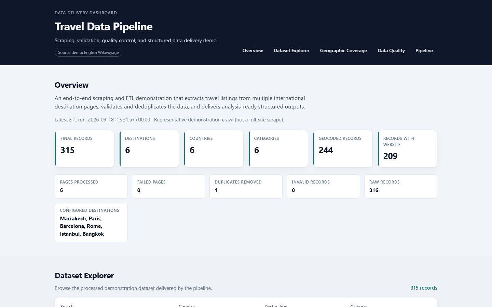
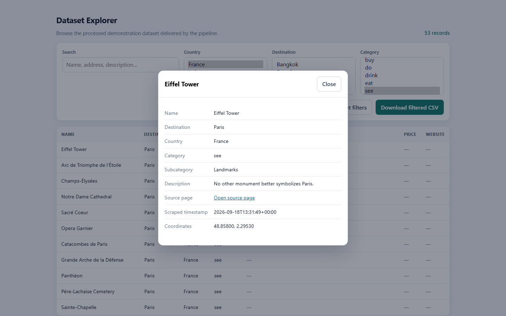
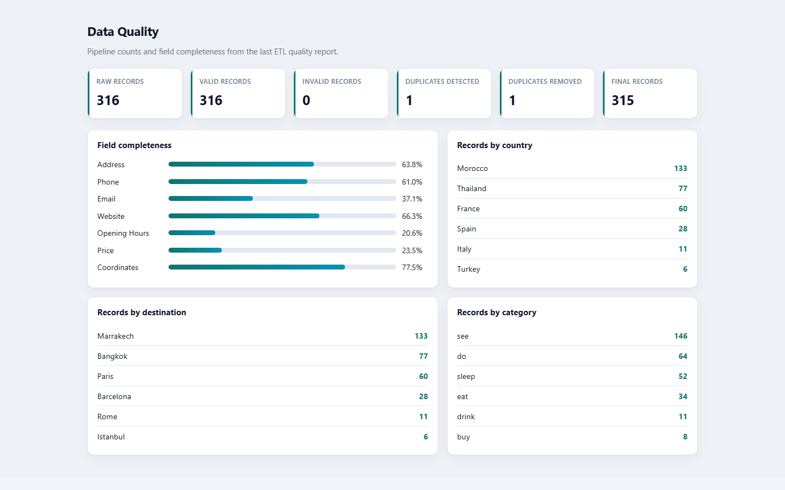
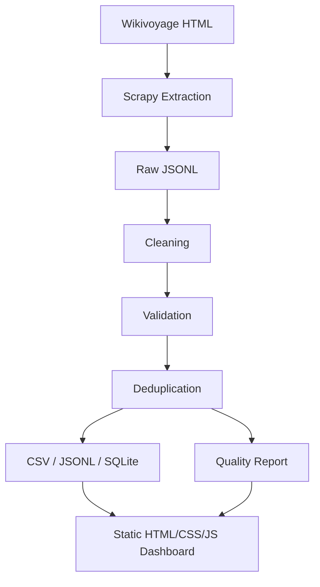

# Travel Data Scraping & ETL Pipeline

An end-to-end Python scraping and ETL pipeline that extracts structured travel listings from multiple international destination pages, validates and deduplicates the data, and delivers analysis-ready CSV, JSONL, SQLite outputs plus a client-facing static Data Delivery Dashboard.



## What It Demonstrates

- Structured Scrapy extraction from English Wikivoyage listing markup
- Cleaning, validation, rejection tracking, and deterministic deduplication
- CSV / JSONL / SQLite delivery with quality reporting
- Responsible crawling (`robots.txt`, throttling, configured pages only)
- Client-facing static Data Delivery Dashboard (HTML/CSS/JavaScript)
- Offline tests and GitHub Actions CI

## Demo Results

From the current international demonstration crawl:

| Metric | Value |
|--------|-------|
| Destinations | Marrakech, Paris, Barcelona, Rome, Istanbul, Bangkok |
| Countries | Morocco, France, Spain, Italy, Turkey, Thailand |
| Pages processed | 6 / 0 failed |
| Raw records | 316 |
| Final records | 315 |
| Duplicates removed | 1 |
| Geocoded records | 244 (77.46%) |

This is an intentionally small representative sample — not a full-site crawl.

## Interface

The **Data Delivery Dashboard** browses delivered records, quality metrics, geographic coverage, and pipeline stages.

<p align="center">
  
  
</p>

```bash
python -m http.server 8080 -d docs
```

Open http://localhost:8080

## Architecture



## Data Schema

`id`, `destination`, `country`, `category`, `subcategory`, `name`, `address`, `latitude`, `longitude`, `phone`, `email`, `website`, `opening_hours`, `price`, `description`, `source_url`, `source_listing_id`, `scraped_at`

Missing source values stay missing.

## Run It

```bash
python -m venv .venv
pip install -e ".[dev]"
python scripts/run_demo.py
python -m http.server 8080 -d docs
```

Optional: `python scripts/build_dashboard_data.py` refreshes `docs/data/` from existing processed outputs without re-crawling.

## Tests

```bash
pytest
ruff check .
```

## Responsible Scraping

- `ROBOTSTXT_OBEY = True`
- Low concurrency, download delay, AutoThrottle
- Configured destination pages only
- The browser dashboard never launches crawls

## Limitations

- Small multi-country demo scope
- Depends on current Wikivoyage HTML listing markup
- Optional fields are often sparse
- Not a JS-rendering, proxy, or distributed crawler

## Data Attribution

Sample and processed listings are derived from Wikivoyage. See [DATA_LICENSE.md](DATA_LICENSE.md). Project code is MIT — [LICENSE](LICENSE).
