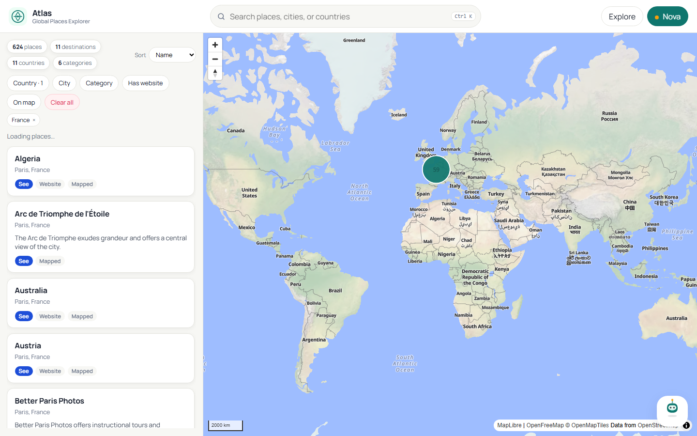
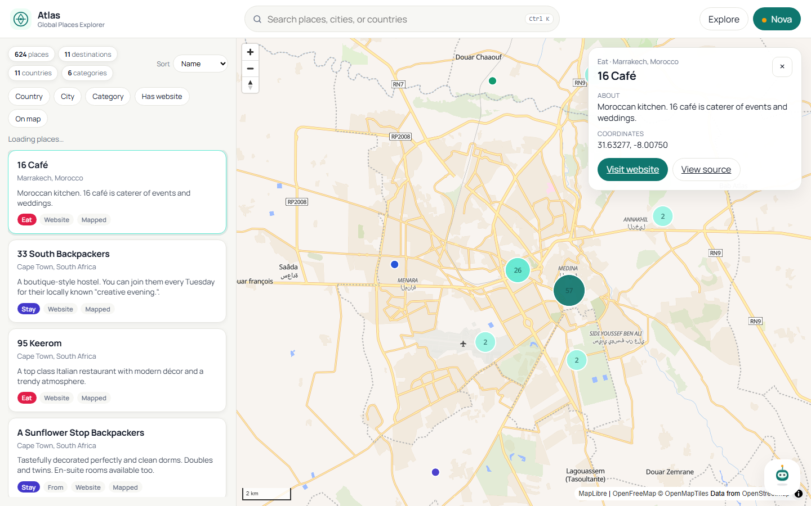
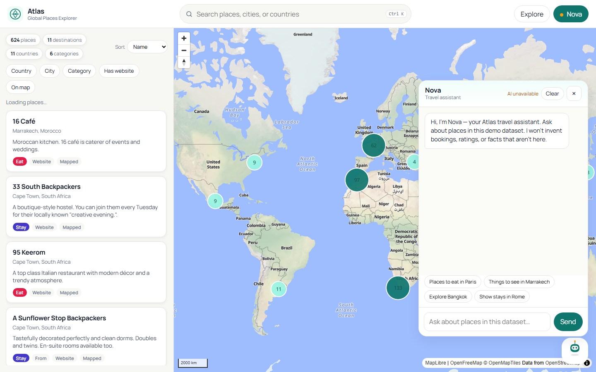
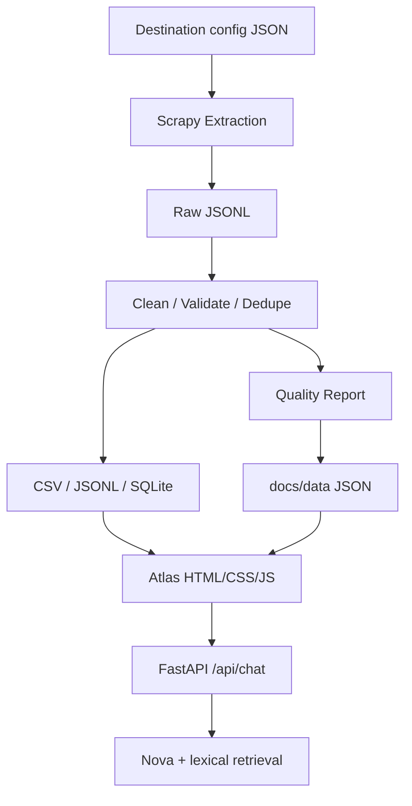

# Travel Data Scraper & Global Explorer

A reusable Python travel-data scraper and ETL project with a polished map-based web demo for exploring structured place data across international destinations.



## Demo

**Atlas** is a premium Global Places Explorer built on the pipeline’s structured outputs. Browse destinations on a vector world map, filter by country, city, and category, open rich place details, and ask **Nova** — a dataset-grounded AI assistant — about what’s in the demo.

<p align="center">
  
  
</p>

## Features

- Destination-config-driven worldwide crawling (any country with explicit metadata)
- Structured Scrapy extraction from English Wikivoyage listing markup
- Cleaning, validation, deduplication, and quality reports
- CSV / JSONL / SQLite delivery
- MapLibre + OpenFreeMap vector map with clustering
- Search, filters, place cards, and details sheet
- Nova AI assistant (Groq by default, optional OpenRouter)
- Offline tests and GitHub Actions CI

## Worldwide Support

The scraper is **destination-config driven**. Provide `{name, country}` pairs for compatible English Wikivoyage pages in any country:

```bash
python scripts/run_demo.py --destinations-file config/demo_destinations.json
```

Country metadata must be explicit in configuration — the crawler never invents it.

The included dataset is a **representative international demo** (about a dozen major cities), not a full-world mirror.

## Run Demo

```bash
python -m venv .venv
pip install -e ".[dev]"

# Scraper + ETL + dashboard JSON
python scripts/run_demo.py --destinations-file config/demo_destinations.json

# Full Atlas app with Nova
python server.py

# Static explorer without AI
python -m http.server 8080 -d docs
```

Open http://127.0.0.1:8080

## AI Configuration

Create a local `.env` (gitignored) using `.env.example`:

```
GROQ_API_KEY=
AI_PROVIDER=groq
AI_MODEL=openai/gpt-oss-20b
```

Optional OpenRouter alternative:

```
AI_PROVIDER=openrouter
OPENROUTER_API_KEY=
OPENROUTER_MODEL=
```

Keys stay server-side only. The browser never receives provider credentials.

## Tests

```bash
pytest
ruff check .
```

## Architecture



## Data Schema

`id`, `destination`, `country`, `category`, `subcategory`, `name`, `address`, `latitude`, `longitude`, `phone`, `email`, `website`, `opening_hours`, `price`, `description`, `source_url`, `source_listing_id`, `scraped_at`

## Responsible Scraping

- `robots.txt` respected
- Low concurrency and AutoThrottle
- Configured destination pages only
- Browser UI never launches crawls

## Limitations

- Demo crawl scope is intentionally small
- Depends on current Wikivoyage HTML listing markup
- Optional fields are often sparse
- Nova answers only from the local demo dataset

## Data Attribution

Sample and processed listings are derived from Wikivoyage. See [DATA_LICENSE.md](DATA_LICENSE.md). Project code is MIT — [LICENSE](LICENSE).
