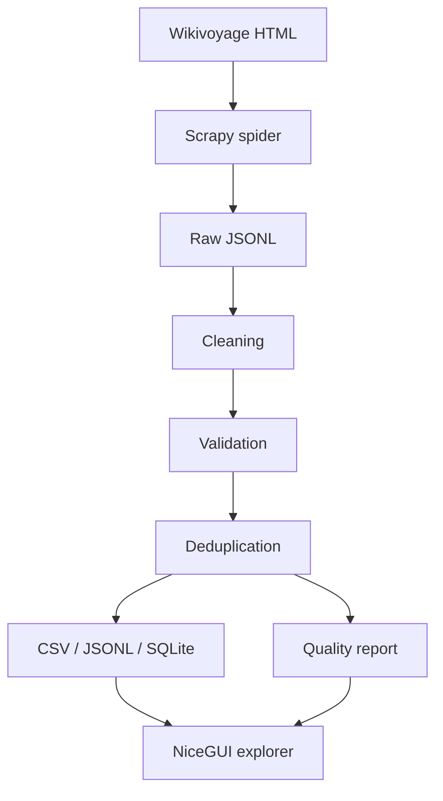

# Travel Data Explorer

An end-to-end Python web scraping and ETL pipeline that extracts structured travel listings across multiple international destinations, normalizes them into a common schema, validates and deduplicates the data, and provides CSV, JSONL, SQLite, quality-report and interactive NiceGUI outputs.

Default destinations are an intentionally small international sample — not a full-site crawl.

## Architecture

| Stage | Role |
|-------|------|
| Scrapy spider | Requests configured Wikivoyage destination pages only |
| Raw JSONL | Preserves source field values before transforms |
| Cleaning | Normalizes text, URLs, phones, coordinates |
| Validation | Checks required fields and ranges; keeps reject reasons |
| Deduplication | Deterministic identity keys; keeps first match |
| Storage | Analysis-ready CSV, JSONL, and SQLite |
| Quality report | Real run metrics (counts, completeness, rejects) |
| NiceGUI | Interactive overview, listings, quality, and pipeline pages |

## Default destinations

| Destination | Country |
|-------------|---------|
| Marrakech | Morocco |
| Paris | France |
| Barcelona | Spain |
| Rome | Italy |
| Istanbul | Turkey |
| Bangkok | Thailand |

Custom destinations can be passed on the CLI. Unknown cities leave `country` empty rather than inventing one.

## Latest demo results

From the current international crawl:

- Pages processed: **6 / 0 failed**
- Raw records: **316**
- Valid / invalid: **316 / 0**
- Duplicates removed: **1**
- Final records: **315**

By destination: Marrakech 133, Bangkok 77, Paris 60, Barcelona 28, Rome 11, Istanbul 6  
By country: Morocco 133, Thailand 77, France 60, Spain 28, Italy 11, Turkey 6

## Project layout

| Path | Role |
|------|------|
| `travel_scraper/` | Scrapy spider + parsing + ETL |
| `app/` | NiceGUI Travel Data Explorer |
| `scripts/run_demo.py` | Full demo orchestration |
| `data/sample/` | Small repository sample |
| `reports/` | Data quality Markdown + JSON |
| `tests/` | Offline unit tests |

## Extracted fields

`id`, `destination`, `country`, `category`, `subcategory`, `name`, `address`, `latitude`, `longitude`, `phone`, `email`, `website`, `opening_hours`, `price`, `description`, `source_url`, `source_listing_id`, `scraped_at`

Missing source values stay missing — nothing is invented.

## Quick start

Python 3.12+. Install with `pip install -e ".[dev]"`, then run `python scripts/run_demo.py` and `python -m app.main` (http://127.0.0.1:8080).

Optional: `--destinations Paris Lisbon Tokyo`, `--skip-crawl`. Set `SCRAPER_USER_AGENT` via `.env` (see `.env.example`).

## Outputs

Processed listings in `data/processed/` (CSV, JSONL, SQLite), a small sample in `data/sample/`, and quality reports in `reports/`.

## Notes

- Crawler obeys `robots.txt`; the UI does not trigger crawls.
- Tests: `pytest` and `ruff check .`
- Code: MIT (`LICENSE`). Derived data: `DATA_LICENSE.md`.
