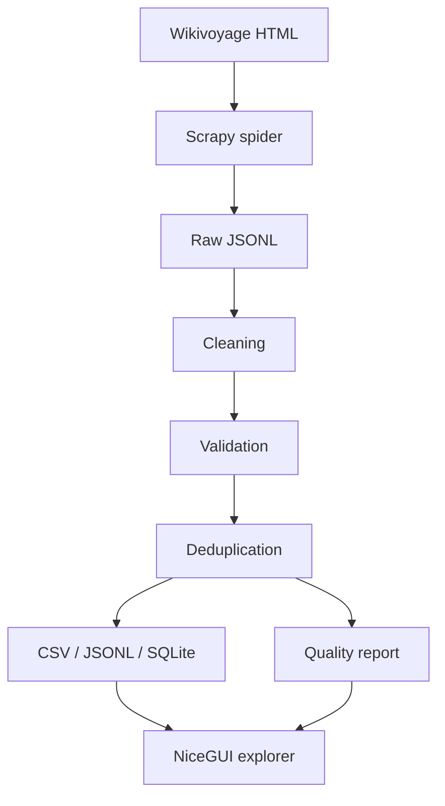

# Travel Data Explorer

An end-to-end Python web-scraping and ETL project that extracts structured travel listings, cleans and validates the data, removes duplicates, stores analysis-ready outputs, and provides an interactive web interface for exploring the results.

**Application name:** Travel Data Explorer  
**Repository:** `travel-data-scraper-etl`

## Project Overview

This demonstration crawls a small, fixed set of English [Wikivoyage](https://en.wikivoyage.org/) destination pages (Moroccan cities by default), extracts structured `see` / `do` / `buy` / `eat` / `drink` / `sleep` listings, runs an explicit ETL pipeline, and serves the results in a NiceGUI explorer.

It is intentionally conservative: only configured destination pages are requested, robots.txt is obeyed, and the public UI never triggers a crawl.

## What This Demonstrates

- Respectful Scrapy crawling with throttling and informative User-Agent configuration
- Field extraction from real listing markup (not page titles alone)
- Normalization, validation with rejection tracking, and deterministic deduplication
- SQLite / CSV / JSONL exports plus a data-quality report
- A service-backed NiceGUI app for filtering, charts, maps, and CSV download
- Offline unit tests and CI (Ruff + pytest)

## Architecture



## Extracted Fields

| Field | Notes |
|-------|--------|
| `id` | Stable project hash of identity fields |
| `destination`, `country` | Destination config |
| `category`, `subcategory` | Listing type / nearest subsection |
| `name`, `address`, `phone`, `email`, `website` | When present on the source |
| `latitude`, `longitude` | Numeric when the source provides them |
| `opening_hours`, `price`, `description` | Concise factual fields only |
| `source_url`, `source_listing_id`, `scraped_at` | Provenance |

Missing source values stay missing — nothing is fabricated.

## Project Structure

```text
travel_scraper/     Scrapy spider, parsing, ETL, storage, quality
app/                NiceGUI Travel Data Explorer
scripts/run_demo.py End-to-end demo orchestration
data/               raw / processed / sample outputs
reports/            Data quality Markdown + JSON
tests/              Offline unit tests + HTML fixtures
```

## Quick Start

Requires **Python 3.12+**.

```bash
python -m venv .venv
```

Activate the virtual environment, then:

```bash
pip install -e ".[dev]"
```

Copy `.env.example` to `.env` and set `SCRAPER_USER_AGENT` to a contactable identifier before publishing (replace `YOUR_USERNAME`).

## Running the Scraper / ETL Demo

```bash
python scripts/run_demo.py
```

Optional flags:

```bash
python scripts/run_demo.py --destinations Marrakech Fes Essaouira
python scripts/run_demo.py --limit 50
python scripts/run_demo.py --skip-crawl
```

`--skip-crawl` re-runs ETL against existing `data/raw/listings_raw.jsonl`.

The demo:

1. Prepares output directories
2. Runs a small Scrapy crawl (unless skipped)
3. Cleans, validates, and deduplicates
4. Writes CSV, JSONL, and SQLite
5. Generates quality reports and a repository sample
6. Prints a concise terminal summary

## Launching the Web App

```bash
python -m app.main
```

Open [http://127.0.0.1:8080](http://127.0.0.1:8080) (override with `APP_HOST` / `APP_PORT`).

The app prefers `data/processed/travel_listings.sqlite`, falls back to `data/sample/travel_listings_sample.csv`, and shows an empty state if neither exists.

## Interactive Data Explorer

| Page | Purpose |
|------|---------|
| **Overview** | KPI cards, charts, Leaflet map, latest ETL summary |
| **Listings** | Search, destination/category filters, AG Grid, details dialog, filtered CSV download |
| **Data Quality** | Pipeline counts, field completeness, rejection reasons |
| **Pipeline** | Architecture and responsible crawl settings (read-only) |

There is no “Run Scraper” button in the UI.

### Screenshots

Capture these manually after launching the app (save under `docs/images/`):

1. **Overview** — KPI row, charts, and map → `docs/images/overview.png`
2. **Listings** — filters + table with a details dialog open → `docs/images/listings.png`
3. **Data Quality** — completeness and rejection summary → `docs/images/data-quality.png`

## Output Formats

| Path | Description |
|------|-------------|
| `data/raw/listings_raw.jsonl` | Raw crawl values |
| `data/processed/travel_listings.csv` | Clean unique listings |
| `data/processed/travel_listings.jsonl` | Same as CSV, JSONL |
| `data/processed/travel_listings.sqlite` | SQLite table `travel_listings` |
| `data/sample/travel_listings_sample.*` | Smaller repo-friendly sample |
| `reports/data_quality_report.md` | Human-readable quality report |
| `reports/data_quality_report.json` | Machine-readable quality report |

## Data Quality

Validation does not silently drop rows: rejects go to `data/processed/rejected_records.jsonl` with reasons. Deduplication uses a deterministic key of destination + normalized name + coordinates (or address). See `travel_scraper/deduplication.py` for the full strategy.

## Testing

```bash
pytest
ruff check .
```

Parser tests use offline HTML fixtures. Live network tests are not part of the default suite.

## Responsible Scraping

- `ROBOTSTXT_OBEY = True`
- Low concurrency and download delay; AutoThrottle enabled
- Limited retries; configured destination pages only
- No image/media downloads; no browser automation
- Configurable User-Agent via `SCRAPER_USER_AGENT`

## Data Source & Attribution

Listings are derived from English Wikivoyage destination articles. Each record keeps a `source_url`. Project code is MIT-licensed (`LICENSE`); source-derived data follows Wikivoyage/Wikimedia terms — see `DATA_LICENSE.md`.

## Limitations

- Demonstration scope: a handful of destination pages, not a full-site crawl
- Relies on current Wikivoyage HTML listing markup (`bdi.vcard` and related classes)
- Optional fields are often sparse (phones, emails, websites vary by page)
- Not a JavaScript-rendering, CAPTCHA, proxy, or distributed crawler
- UI is desktop-oriented; no authentication or multi-user deployment features

## License

- Code: MIT — see `LICENSE`
- Derived data: see `DATA_LICENSE.md`
